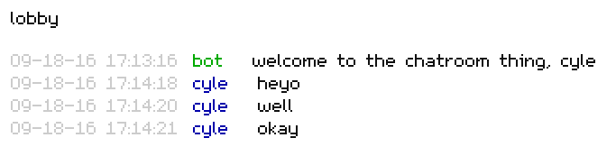

# PHP/JS/Redis chatroom

A really simple proof of concept chatroom using PHP 7, Redis, and some vanilla Javascript.

## Requirements

- PHP 7
- Redis 2.8+ i guess
- the [php-redis](https://github.com/phpredis/phpredis) extension
- Nginx, apache, lighttpd, i don't care
- client-side only tested in chrome but it should be cool with any modern browser

## Setup / Usage

Drop this folder of files somewhere on your server running the above requirements, and go to `index.html`. That's all.

Put in your username and the name of the chatroom you wanna chat in.

Give a link to the place to other people and they can hop in too.

## Caveats / Warnings

This isn't ready for any kind of production environment because:

- There's no username tracking so you could have ten people with the same username.
- This is 100% polling based so you could knock over your server if you have a ton of people connected.
- There's very little security to chatroom names, usernames, and messages beyond php `strip_tags()`
- The chatroom name could be anything really. You could have lots of chatrooms running in multiple tabs.

## API Spec

The `chatroom.php` script has a very simple API that I've documented in the [SPEC.md](SPEC.md) file.

## Credit

The amazing [m5x7 font](https://managore.itch.io/m5x7) is by [Daniel Linssen](https://twitter.com/managore).
